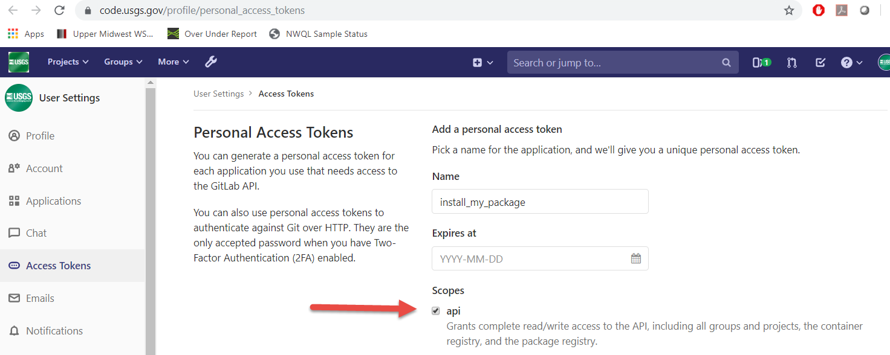

```{r, echo = FALSE}
knitr::opts_chunk$set(echo = TRUE,
                      warning = FALSE,
                      message = FALSE,
                      fig.width = 7,
                      fig.height = 7,
                      collapse = TRUE,
                      comment = "#>",
                      fig.path = "man/figures/"
)
```

# HASP

Hydrologic AnalySis Package

Inspiration:
https://fl.water.usgs.gov/mapper/

## Sample workflow

### Single site workflows:
```{r singleSiteShow, echo=TRUE, eval=FALSE}
library(HASP)
library(dataRetrieval)
site <- "263819081585801"

#Periodic data:
gwl_data <- dataRetrieval::readNWISgwl(site)


# Daily data:
parameterCd <- "62610"
statCd <- "00001"
dv <- dataRetrieval::readNWISdv(site,
                                parameterCd,
                                statCd = statCd)

# Water Quality data:
parameterCd <- c("00095","90095","00940","99220")
qw_data <- dataRetrieval::readNWISqw(site,
                                     parameterCd)


```

```{r singleSite, echo=FALSE, eval=TRUE}
library(HASP)

gwl_data <- L2701_example_data$Discrete
dv <- L2701_example_data$Daily
qw_data <- L2701_example_data$QW

```

```{r graphs, echo=TRUE, eval=TRUE}
monthly_frequency_plot(gwl_data, "L2701_example_data")
gwl_plot_periodic(gwl_data, "L2701_example_data")
gwl_plot_all(dv, gwl_data, "L2701_example_data")
Sc_Cl_plot(qw_data, "L2701_example_data")
trend_plot(qw_data, plot_title = "L2701_example_data")
```

### Composite workflows:
```{r example}

#included sample data:

aquifer_data <- aquifer_data
sum_col <- "lev_va"
num_years <- 30

plot_composite_data(aquifer_data, sum_col, num_years)

plot_normalized_data(aquifer_data, sum_col, num_years)
```

## Shiny App

<p align="center">
  
</p>

## Installation

To install the package while the package is still internal, users will need to get a "Personal Access Token" from code.usgs.gov. 

1. Go to https://code.usgs.gov/profile/personal_access_tokens
2. Create a Personal Access Token and click the "api" scope:

3. After clicking the green "Create personal access token", you will see a screen like this:

4. Save your token in a safe place (KeyPass for instance) so you don't need to constantly regenerate tokens. 
5. In R, you can will need the `remotes` package to install:
```{r install, eval=FALSE}
remotes::install_gitlab("water/stats/HASP", 
                        host = "code.usgs.gov", 
                        auth_token = "abc123",
                        build_vignettes = TRUE, 
                        build_opts = c("--no-resave-data",
                                       "--no-manual"))
```

## Disclaimer

This software is preliminary or provisional and is subject to revision. It is being provided to meet the need for timely best science. The software has not received final approval by the U.S. Geological Survey (USGS). No warranty, expressed or implied, is made by the USGS or the U.S. Government as to the functionality of the software and related material nor shall the fact of release constitute any such warranty. The software is provided on the condition that neither the USGS nor the U.S. Government shall be held liable for any damages resulting from the authorized or unauthorized use of the software.

