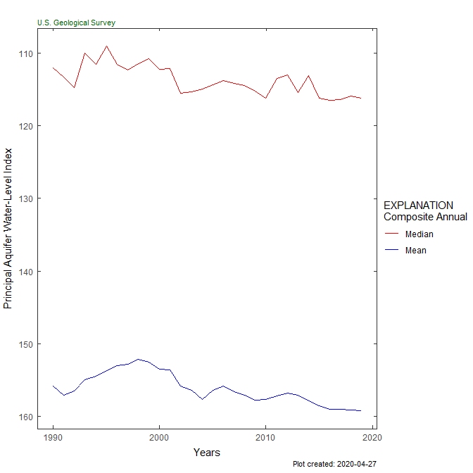

# HASP

Hydrologic AnalySis Package

Inspiration: <https://fl.water.usgs.gov/mapper/>

## Sample workflow

``` r
library(HASP)
#included sample data:

aquifer_data <- aquifer_data
sum_col <- "lev_va"
num_years <- 30

plot_composite_data(aquifer_data, sum_col, num_years)
```

<!-- -->

``` r

plot_normalized_data(aquifer_data, sum_col, num_years)
```

<!-- -->

## Shiny App

<p align="center">


</p>

## Installation

To install the package while the package is still internal, users will
need to get a “Personal Access Token” from code.chs.usgs.gov.

1.  Go to <https://code.chs.usgs.gov/profile/personal_access_tokens>
2.  Create a Personal Access Token and click the “api” scope:
    
3.  After clicking the green “Create personal access token”, you will
    see a screen like this: 
4.  Save your token in a safe place (KeyPass for instance) so you don’t
    need to constantly regenerate tokens.
5.  In R, you can will need the `remotes` package to install:

<!-- end list -->

``` r
remotes::install_gitlab("water/HASP", 
                        host = "code.chs.usgs.gov", 
                        auth_token = "abc123",
                        build_vignettes = TRUE, 
                        build_opts = c("--no-resave-data",
                                       "--no-manual"))
```

## Disclaimer

This software is preliminary or provisional and is subject to revision.
It is being provided to meet the need for timely best science. The
software has not received final approval by the U.S. Geological Survey
(USGS). No warranty, expressed or implied, is made by the USGS or the
U.S. Government as to the functionality of the software and related
material nor shall the fact of release constitute any such warranty. The
software is provided on the condition that neither the USGS nor the U.S.
Government shall be held liable for any damages resulting from the
authorized or unauthorized use of the software.
