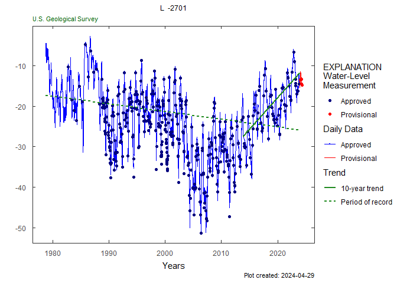
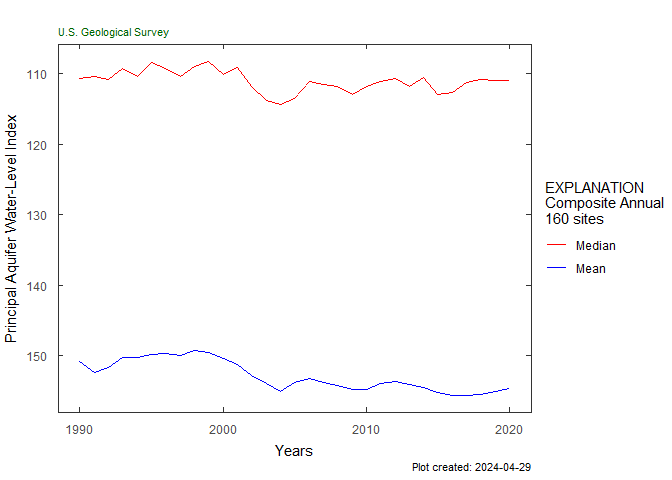

# HASP: Hydrologic AnalySis Package 

[](https://code.usgs.gov/water/stats/hasp/pipelines)
[](https://rconnect.usgs.gov/HASP_docs/)
[](https://code.usgs.gov/water/stats/hasp)
[](https://code.usgs.gov/water/stats/hasp/-/tree/1.0.0)

*H*ydrologic *A*naly*S*is *P*ackage

The [Hydrologic Analysis Package
(HASP)](https://code.usgs.gov/water/stats/hasp) can retrieve groundwater
level and groundwater quality data, aggregate these data, plot them, and
generate basic statistics. One of the benefits of HASP is its ability to
aggregate two time-series of data into one record and generate
statistics and graphics on that record. By merging two data sets
together, users can view and manipulate a much longer record of data.
Users can download the aggregated record and see basic statistics that
have been calculated with these data. HASP also allows users to plot
groundwater level trends in major aquifers as well. The explore_aquifers
function allows users to pull data from wells classified in Principal
Aquifers and synthesize water-level data to better understand trends.

Inspiration: <https://fl.water.usgs.gov/mapper/>

See <https://rconnect.usgs.gov/HASP_docs/> for more information!

## Installation of HASP

You can install the `HASP` package using the `remotes` package.

To install the remotes package, copy the following line into R or the
“Console” window in RStudio:

``` r
install.packages("remotes")
```

To install the `HASP` package:

``` r
remotes::install_gitlab("water/stats/hasp",
                        host = "code.usgs.gov",
                        build_opts = c("--no-resave-data",
                                       "--no-manual"),
                        build_vignettes = TRUE, 
                        dependencies = TRUE)
```

During this installation, you may be prompted to update or install some
packages. Press 3 to skip the updates, but don’t forget to update all of
your packages later.

## Sample workflow

### Get groundwater data:

``` r
library(HASP)
library(dataRetrieval)
site <- "263819081585801"

#Field GWL data:
gwl_data <- dataRetrieval::readNWISgwl(site)

# Daily data:
parameterCd <- "62610"
statCd <- "00001"
dv <- dataRetrieval::readNWISdv(site,
                                parameterCd,
                                statCd = statCd)
```

### Plot data:

``` r

y_axis_label <- readNWISpCode(parameterCd)$parameter_nm
title <- readNWISsite(site)$station_nm

monthly_frequency_plot(dv,
                       gwl_data,
                       parameter_cd = parameterCd,
                       plot_title = title,
                       y_axis_label = y_axis_label)
```

<!-- -->

``` r

weekly_frequency_plot(dv, 
                      gwl_data,
                      parameter_cd = parameterCd, 
                      stat_cd = statCd,
                      plot_title = title,
                      y_axis_label = y_axis_label)
```

<!-- -->

``` r

daily_gwl_plot(dv, 
               gwl_data,
               parameter_cd = parameterCd,
               plot_title = title,
               stat_cd = statCd,
               y_axis_label = y_axis_label)
```

<!-- -->

``` r

gwl_plot_all(gw_level_dv = dv, 
             gwl_data = gwl_data, 
             parameter_cd = parameterCd,
             plot_title = title, 
             add_trend = TRUE)
```

<!-- -->

## Create Groundwater Report:

``` r
create_groundwater_report(siteID = site,
                          report_name = "L_2701",
                          report_folder = "reports",
                          output_type = "html")
```

Running this function will create an Rmarkdown file (Rmd). In RStudio,
clicking the button “Knit” at the top of the file will render the Rmd
file as either an HTML or Word document.

## Water-quality plots

HASP also includes a few water-quality plot options.

``` r
# Water Quality data:

qw_data <- readWQPqw(paste0("USGS-", site),
                     c("Chloride",
                       "Specific conductance"))

qw_plot(qw_data, CharacteristicName = "Chloride",
        plot_title = title)
```

<!-- -->

``` r

Sc_Cl_plot(qw_data, plot_title = title)
```

<!-- -->

### Composite workflows:

More information on the composite aquifer workflow can be found
`vignette("Priniciple_Aquifers", package = "HASP")`.

``` r

#included sample data:

aquifer_data <- aquifer_data
num_years <- 30

plot_composite_data(aquifer_data, num_years)
```

<!-- -->

``` r

plot_normalized_data(aquifer_data, num_years)
```

<!-- -->

## Citing HASP

``` r
citation(package = "HASP")
#> To cite HASP in publications, please use:
#> 
#>   DeCicco, L.A., Prinos, S.T., Eslick-Huff, P.J., Hopkins, C.B., 2022,
#>   HASP: Hydrologic AnalySis Package, v1.0.0.,
#>   https://code.usgs.gov/water/stats/hasp, doi:10.5066/P9BUN5GV
#> 
#> A BibTeX entry for LaTeX users is
#> 
#>   @Manual{,
#>     author = {Laura DeCicco and Scott Prinos and Patrick Eslick-Huff and Candice Hopkins and Tara Root},
#>     title = {HASP: Hydrologic AnalySis Package},
#>     publisher = {U.S. Geological Survey},
#>     address = {Reston, VA},
#>     version = {1.0.0},
#>     institution = {U.S. Geological Survey},
#>     year = {2022},
#>     doi = {10.5066/P9BUN5GV},
#>     url = {https://code.usgs.gov/water/stats/hasp},
#>   }
```


## Running the apps

`HASP` includes two interactive applications as a way to explore the
functionality of this package. One has functions for exploring data from
a single site, and the other has functions for exploring data from an
aquifer.

For more information see `vignette("shinyApp", package = "HASP")`.

To run the single site application, use the following code:

``` r
HASP::explore_site()
```

To run the aquifer application use the following code:

``` r
HASP::explore_aquifers()
```

## Disclaimer

This software is preliminary or provisional and is subject to revision.
It is being provided to meet the need for timely best science. The
software has not received final approval by the U.S. Geological Survey
(USGS). No warranty, expressed or implied, is made by the USGS or the
U.S. Government as to the functionality of the software and related
material nor shall the fact of release constitute any such warranty. The
software is provided on the condition that neither the USGS nor the U.S.
Government shall be held liable for any damages resulting from the
authorized or unauthorized use of the software.

Any use of trade, firm, or product names is for descriptive purposes
only and does not imply endorsement by the U.S. Government.
