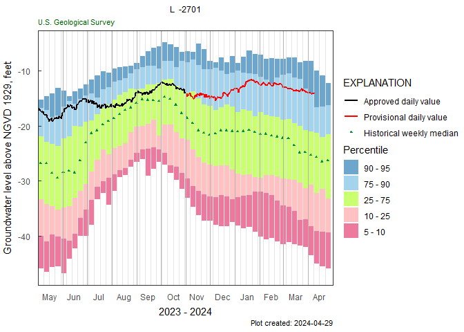
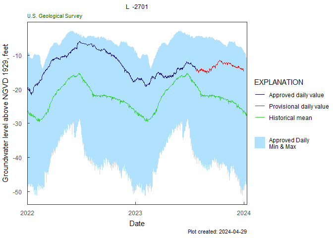
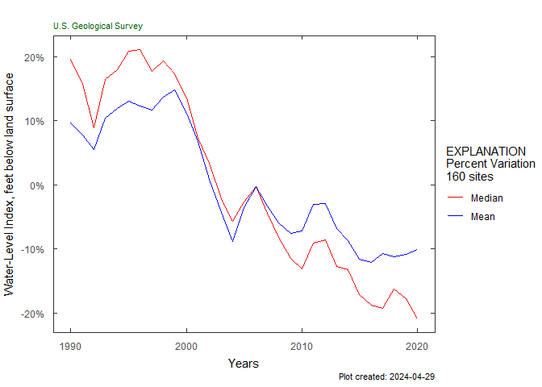

# HASP 

[](https://github.com/USGS-R/HASP/actions)
[](https://coveralls.io/github/USGS-R/HASP?branch=master)
[](https://codecov.io/gh/USGS-R/HASP)
[](https://owi.usgs.gov/R/packages.html#research)

Hydrologic AnalySis Package

Inspiration: <https://fl.water.usgs.gov/mapper/>

See <https://usgs-r.github.io/HASP/> for more information\!

## Sample workflow

### Single site workflows:

``` r
library(HASP)
library(dataRetrieval)
site <- "263819081585801"

#Field GWL data:
gwl_data <- dataRetrieval::readNWISgwl(site)

# Daily data:
parameterCd <- "62610"
statCd <- "00001"
dv <- dataRetrieval::readNWISdv(site,
                                parameterCd,
                                statCd = statCd)

# Water Quality data:
parameterCd <- c("00095","90095","00940","99220")
qw_data <- dataRetrieval::readNWISqw(site,
                                     parameterCd)
```

``` r

y_axis_label <- dataRetrieval::readNWISpCode("62610")$parameter_nm

monthly_frequency_plot(dv,
                       date_col = "Date",
                       value_col = "X_62610_00001",
                       approved_col = "X_62610_00001_cd",
                       plot_title = "L2701_example_data",
                       y_axis_label = y_axis_label)
```

<!-- -->

``` r

gwl_plot_all(gw_level_dv = dv, 
             gwl_data = gwl_data, 
             parameter_cd_gwl = "62610",
             date_col = c("Date", "lev_dt"),
             value_col = c("X_62610_00001", "sl_lev_va"),
             approved_col = c("X_62610_00001_cd",
                              "lev_age_cd"),
             plot_title = "L2701_example_data", 
             add_trend = TRUE, flip_y = FALSE)
```

<!-- -->

``` r

Sc_Cl_plot(qw_data, "L2701_example_data")
```

<!-- -->

``` r
trend_plot(qw_data, plot_title = "L2701_example_data")
```

<!-- -->

### Composite workflows:

``` r

#included sample data:

aquifer_data <- aquifer_data
num_years <- 30

plot_composite_data(aquifer_data, num_years)
```

<!-- -->

``` r

plot_normalized_data(aquifer_data, num_years)

```

<!-- -->

## Shiny App

<p align="center">


</p>

## Installation of R and RStudio

To use the HASP package, you will need to have R and RStudio installed
on your computer. This installation will only need to be done once for
each computer. This link has instructions for installing R and RStudio:

[R and RStudio Installation
Instructions](https://owi.usgs.gov/R/training-curriculum/installr/)

Useful links:

  - [Download R Windows](https://cran.r-project.org/bin/windows/base/)
  - [Download R Mac](https://cran.r-project.org/bin/macosx/)
  - [Download
    RStudio](https://www.rstudio.com/products/rstudio/download/)

## Installation of HASP

You can install the `HASP` package using the `remotes` package.

To install the remotes package, copy the following line into R or the
“Console” window in RStudio:

``` r
install.packages("remotes")
```

To install the `HASP` package:

``` r
remotes::install_github("USGS-R/HASP")
```

During this installation, you may be prompted to update or install some
packages. You can press 1 to update all packages.

## Running the apps

`HASP` includes two interactive applications as a way to explore the
functionality of this package. One has functions for exploring data from
a single site, and the other has functions for exploring data from an
aquifer.

To run the single site application, use the following code:

``` r
HASP::explore_site()
```

To run the aquifer application use the following code:

``` r
HASP::explore_aquifers()
```

## Disclaimer

This software is preliminary or provisional and is subject to revision.
It is being provided to meet the need for timely best science. The
software has not received final approval by the U.S. Geological Survey
(USGS). No warranty, expressed or implied, is made by the USGS or the
U.S. Government as to the functionality of the software and related
material nor shall the fact of release constitute any such warranty. The
software is provided on the condition that neither the USGS nor the U.S.
Government shall be held liable for any damages resulting from the
authorized or unauthorized use of the software.
