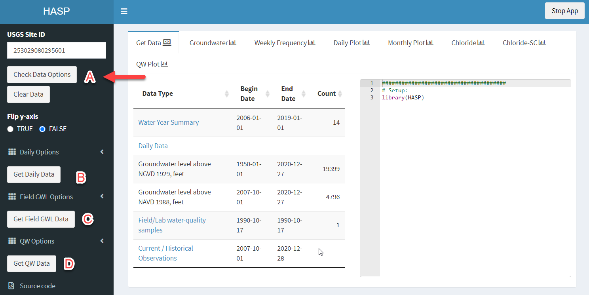

```{r setup, include=FALSE}
library(knitr)
library(rmarkdown)
library(HASP)
options(continue=" ")
options(width=60)
knitr::opts_chunk$set(echo = TRUE,
                      fig.width = 7,
                      warning = FALSE,
                      message = FALSE)
```


# Using the Shiny Application

To start the app, open the `HASP` library, and use the function `explore_site()`:

```{r eval=FALSE}
library(HASP)
explore_site()
```

This will open the default browser. 

## Check site

To begin:

```{r echo=FALSE, out.width="90%"}

```

Input a USGS Site ID into the upper left text box, then click "Check Data Options". This will populate a table in the center of the screen summarizing the data available. At a minimum, use this information to verify you have entered the correct site.


Click on the "Get Daily Data" (B), "Get Field GWL Data" (C), and/or "Get QW Data" (D). The lower-right corner will show a message "Loading..." while the app requests and retrieves the data. For sites with a lot of data, this could take awhile. Have patience, and wait until the lower-right message disappears to continue.

```{r echo=FALSE, out.width="90%"}

```

The right side of the "Get Data" tab shows the R code required to get the data. Copy and paste this code into an R script to initiate your reproducible code.

## Analyze Data:

Explore each of the tabs across the top. Each tab generally has a plot on the left, a table on the right, and the R code to get that output at the bottom. 

```{r echo=FALSE, out.width="90%"}
knitr::include_graphics("tab.png")
```

In this example, there are 2 buttons below the "Groundwater" plot, one to download a simple png, and one to download the plot data. On the right is a summary table. This table can be downloaded as a csv. 

For complete customization of plots or tables, copy the R code to a R-script, and make adjustments as needed. The app is used to quickly explore the data and package options, and introduce the user to the R code involved. For specific analysis, the users will need to use R outside of the Shiny application.
